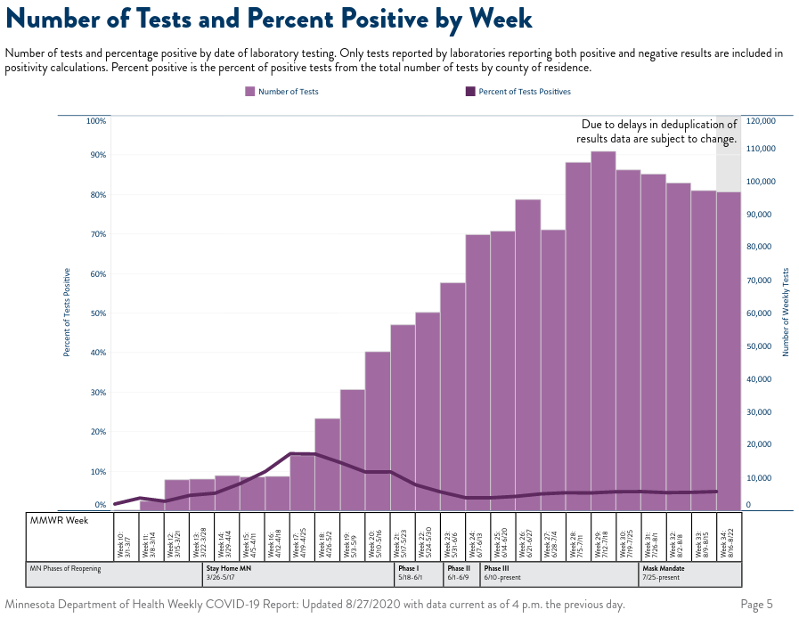

# UofMN Releases a COVID Dashboard

Campus Dashboards:
  - [Twin-Cities](https://safe-campus.umn.edu/return-campus/covid-19-dashboard)
  - [Crookston](https://protectthenest.crk.umn.edu/)
  - [Duluth](https://safe-campus.d.umn.edu/covid-dashboard)
  - [Morris](https://morris.umn.edu/covid-19-resources/covid-19-dashboard)
  - [Rochester](https://r.umn.edu/COVID-19-Dashboard)

Overall, this is great news. (Much better than no data.) [A high positive percent rate indicates there is a high number of people who are infected and do not know it](https://www.jhsph.edu/covid-19/articles/covid-19-testing-understanding-the-percent-positive.html). It is a critical stat for judging personal safety at the U.

That doesn't mean we don't need more data! I'm not sure if the UofMN has data collected from other sources or if they are allowed to release that data. During a test people are supposed to state where they go to school or work, so the state should have this data. FOIA

The dashboards publish COVID-19 for tests performed by the UofMN. There are two UofMN COVID-19 testing groups: Boynton (Twin-Cities campus) and UMD-HS (Duluth campus). Therefore, Crookston, Morrison, and Rochester's dashboards do not include test data.

Boynton test data includes (1) Number of tests, (2) Student positive cases, (3) Non-student positive cases, (4) Total positive cases, and (5) Percentage of positive cases. These data types are represented as a cumulative and weekly value. Duluth is similar, but does not include non-student data.

As it appears now, only the cumulative and weekly data is reported. It is unknown if historical data will be provided next week, which is important for accurate reporting. Most COVID-19 tests cannot be read immediately, so tests administered near the end of the week may not be reported. To address this, The Weekly COVID-19 Report from the Minnesota Department of Health (MDH) the most recent week is highlighted as subject to change and updated in future reports.

Also, all campus dashboards include usage data for dorm rooms set aside for students living on campus to isolate or quarantine.

[This spreadsheet](./umn-covid-dashboards.csv) will record data published to the UofMN dashboards. It also includes the weekly percentage of positives cases for Minnesota as reported by the MDH.

Two questions I have about the data is:
  - Does Duluth offer COVID-19 tests to faculty and staff?
  - What is the maximum number of COVID-19 tests that Boynton and UMD-HS can handle on a weekly basis?
